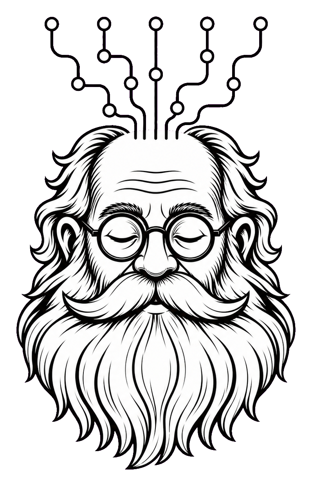

<div align="center">
  
</div>

<h1 align="center">Greybeard</h1>

<p align="center">
  <strong>Institutional memory for AI coding agents.</strong>
</p>

<p align="center">
  Every commit. Every decision. Every lesson. Remembered.
</p>

**greybeard** is a **decision-memory** for your codebase. It captures the durable engineering
decisions that normally live only in a senior engineer's head — the conventions, the hard-won
"we tried that and it broke," the "always do X because Y" — and stores them as markdown files
that evolve with your repo, gated through PR review, so they survive turnover and get **enforced**
on new changes.

## Why

Most engineering knowledge evaporates the moment it's created:

- A reviewer explains why 100% trace sampling is wrong… in a comment thread nobody reads again.
- A team agrees on a retry convention… then re-litigates it three PRs later.
- The one person who knew who owns that event hub leaves.

greybeard turns that ephemeral knowledge into a queryable, enforceable bank.

## The three skills

Each skill is an **imperative to the greybeard** — *you* command it to learn, to remember, to review.

| Skill | Invoke | What it does |
|-------|--------|--------------|
| **learn** | `/greybeard:learn` | Mines your merged PR history — review comments, PR descriptions, and the merged diffs — for durable decisions, **verifies each against the code that actually shipped**, and bootstraps your `docs/greybeard/` folder. Run once at setup. |
| **remember** | `/greybeard:remember` | Captures one decision by hand. Interviews you for the rule, the *why*, and the evidence, then suggests a PR as the next step. Use right after a design call. |
| **review** | `/greybeard:review` | Checks a supplied change against your recorded decisions and flags changes that break one — citing the rule, the *why*, and the original evidence. |

## How each skill works

### `review` — one sub-agent per decision file, all in parallel

Point `/greybeard:review` at a PR, a diff, a branch, local changes, a document, or any change you
ask about, and it **spins up one sub-agent for every category decision file in `docs/greybeard/`**.
`index.md` is just the map and does not get its own reviewer. Each sub-agent owns exactly one
category file and checks the change *only* against the decisions recorded there — matching by
**meaning** against current contents where available, never by line number. The sub-agents
run in parallel (≤5, one per topic file), then a reducer merges their
findings into a single report that flags every change which breaks a recorded decision, citing the
**rule**, the **why**, and the **original evidence** behind it.

That one-file-per-agent split is deliberate: each reviewer sees a tight, focused slice of the
decision bank plus the supplied change and nothing else, which keeps its judgement sharp and false
alarms low. For PR and branch targets, decisions are read from the **base branch**, so a PR can
never quietly weaken the very rules it is being judged against. For other targets, `review` uses the
provided or current decision bank.

### `learn` — bootstrap the bank from history

`/greybeard:learn` mines your last *N* **merged** PRs — review comments, PR descriptions, and the
merged diffs — distributing the scan across up to 5 sub-agents. It **verifies every candidate
against the code that actually shipped** (a reviewer objection that was overruled is *not* a
decision), clusters the survivors, and writes decision files for you to review before any PR action.
Run it once at setup, or re-run in `extend` mode to fold in newer history.

### `remember` — capture a decision by hand

`/greybeard:remember` records a single decision the moment it's made. It interviews you for the
rule, the *why*, and the evidence, checks it against the existing bank for duplicates or
supersession, and suggests a PR as the next step — so the reasoning is captured before it
evaporates.

## How decisions are stored

A `docs/greybeard/` folder on your main branch, updated through normal PRs. Only `index.md` is
fixed — the category files are **emergent and capped at 5**, named for whatever your codebase
actually cares about:

```
docs/greybeard/
  index.md          # the map: one line + link per decision (always present)
  <topic>.md        # a cluster of related decisions — e.g. api-compat, testing, data-privacy
  ...               # at most 5 topic files; greybeard merges before it ever opens a 6th
```

Nothing is hardcoded: a token-handling service grows `data-privacy.md`, a UI library grows
`accessibility.md`. New decisions reuse the closest existing file; a new file appears only when a
decision fits none — never beyond 5. `evidence-type` (`code-checkable` or `human-attested`) is a
per-decision entry field, not a folder or frontmatter.

The canonical candidate rules live in `skills/decision-candidate.md`; `learn` sub-agents and
`remember` use that file instead of duplicating the decision-identification rules. The canonical
entry schema lives in `skills/decision-format.md`; `learn`, `remember`, and `review`
reference that file instead of duplicating the format.

Nothing becomes canon until a human approves the PR. That review gate is the precision backstop.

## Design principles

- **Adoption-gated when mined.** A decision learned from PR history is captured only if the merged
  code actually adopted it. A reviewer objection that was *overruled* is not a decision — storing it
  would make `review` flag conformant code. Manual `remember` entries may be forward-looking, but
  still need a why, evidence, and human PR review.
- **Precision over recall.** A wrong decision poisons every future review, so when unsure greybeard
  drops the candidate or flags it for a human.
- **Recency wins.** A newer decision that contradicts an older one supersedes it; the old entry is
  *tombstoned*, never deleted.
- **Evidence, always.** Every decision traces to concrete evidence: a PR / merge SHA / quote for
  code-checkable entries, or a named attestor for human-attested entries.

## Install

greybeard follows the standard plugin layout — a manifest in `.claude-plugin/plugin.json` and the
three skills under `skills/`. Install it with your agent's plugin manager (e.g. GitHub Copilot CLI
or Claude Code), or clone it into your plugins directory. The skills then become available as:

```
/greybeard:learn       # bootstrap decisions from PR history
/greybeard:remember    # record a decision by hand
/greybeard:review      # check a change against the decision bank
```

## License

[MIT](LICENSE)
